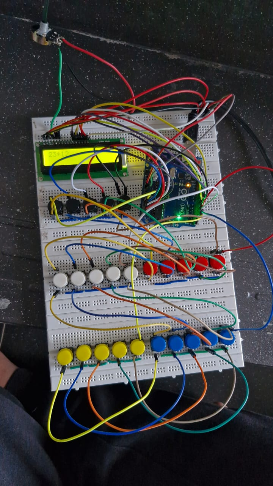

# Arduino-Based Scientific Calculator

This project is a scientific calculator built using an **Arduino Uno**, a **16x2 LCD display**, and a **5x5 tactile push-button matrix**.

## 🛠 Features

- Basic arithmetic operations: `+`, `-`, `*`, `/`
- Scientific functions: `sin`, `cos`, `log`, `sqrt`, `cbrt`
- Constant: `π`
- Nested function support (e.g., `sin(log(100))`)
- BODMAS precedence implemented
- LCD output with custom expression parser
- Written in Arduino IDE using C++
- Future plan: rewrite in `avr-gcc`

## 📷 Hardware Setup

- **LCD Pins:** D7 to D12
- **Keypad Rows:** D2 to D6
- **Keypad Columns:** A0 to A4
- **Contrast Control:** Potentiometer
- **Power:** USB via Arduino UNO

## 🔩 Components Used

| Component       | Quantity |
|----------------|----------|
| Arduino Uno     | 1        |
| LCD 16x2 (JHD162A) | 1    |
| Tactile Switches | 25       |
| Potentiometer   | 1        |
| Breadboard or PCB | 1      |

## 💻 Code Structure

- **Keypad Scanning**
- **Expression Parser**
- **BODMAS Evaluator**
- **Function Evaluators**
  - Numerical methods for `sin`, `cos`, `log`, `sqrt`, `cbrt`

## 📄 Screenshot

## 📈 Future Improvements

- Rewrite in AVR-GCC
- Add memory/register support
- Implement better error handling

Made with ❤️ using Arduino.

